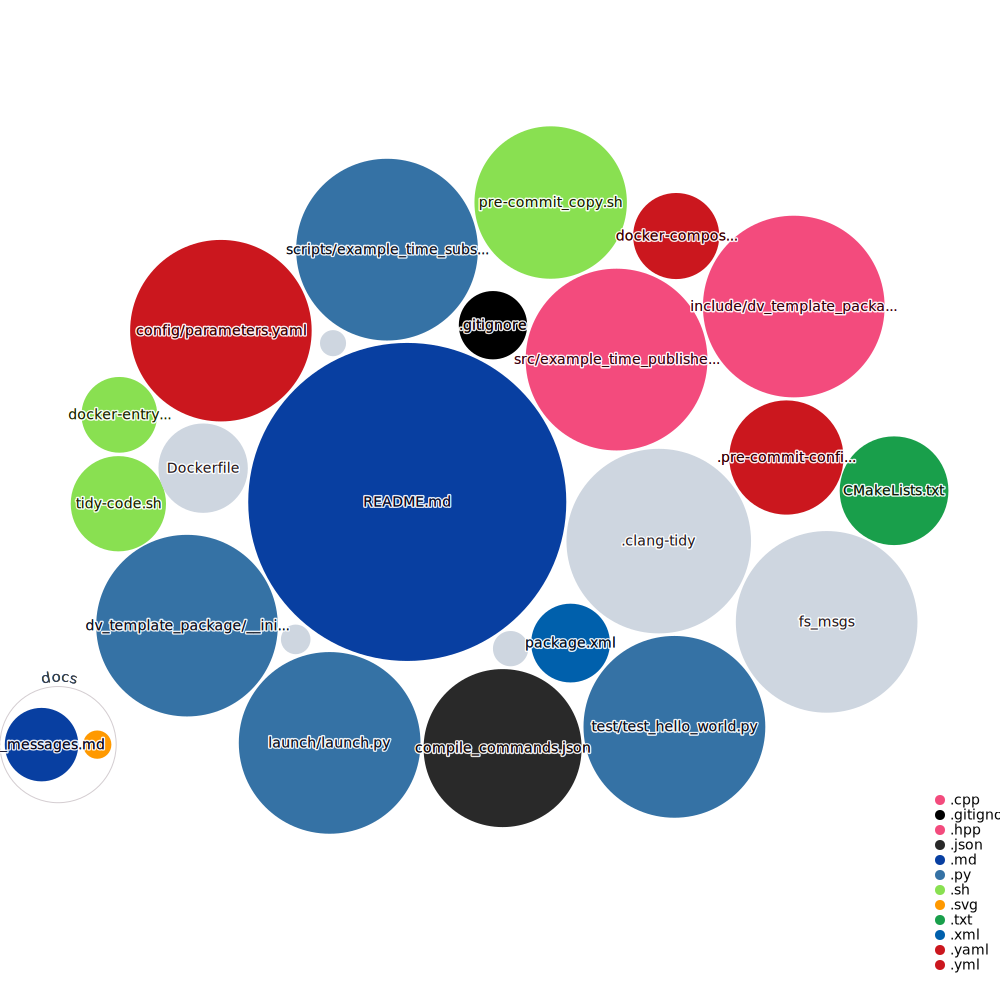

# DV-TEMPLATE-PACKAGE (ROS2 Jazzy)

Example of generic package development of DV pipeline packages for ROS2 Jazzy. You should create a new repository from this template (by clicking `Use this template` &rarr; `Create a new repository`) and replace the content with your own package, source code, and documentation.

## Table of Contents

- [Guidelines](#guidelines)
  - [Overview](#overview)
  - [Enforced](#enforced)
  - [Encouraged](#encouraged)
- [Development](#development)
  - [Creating a package](#creating-a-package)
  - [Graphical User Interface (GUI) Support](#graphical-user-interface-gui-support)
- [Deployment](#deployment)
  - [Prerequisites](#prerequisites)
  - [Building and Running](#building-and-running)
    - [Stopping and Cleanup](#stopping-and-cleanup)
- [Validation and Testing](#validation-and-testing)
- [Troubleshooting](#troubleshooting)
- [Resources](#resources)
- [Codebase Diagram](#codebase-diagram)

## Guidelines

For this new CI Branch for pre-commits

```bash
./setupenv.sh
```

If you just want to check C++ Code Correctness for modified C++ files before adding to commit =>

```bash
./tidy-code.sh
```

### Overview

- Our final pipeline will be constructed using Docker-compose to launch all individual packages. This will be based on the Dockerfiles from each package repo.
- ROS2 uses a decentralized architecture with DDS (Data Distribution Service), so no separate ROS master is needed.
- All packages will firstly be built through an entrypoint script using `colcon build` and then launched with a launch file using the command (CMD) instruction in the Docker-compose file.

### Enforced

- Repository name ending with "_pkg".

- Main branch always in a deployable state.

- ROS2 package must be runnable standalone from other ROS nodes without the package nodes crashing.

- Document what messages and message types are used in the package in the [ROS messages](./docs/ros_messages.md) markdown file. This is to make it easier to understand the inputs and outputs of the package and to make it easier to integrate with other packages.

- [Dockerfile](Dockerfile) installs all package dependencies and sets up the workspace directory in a Docker container.

- Working ROS2 package that can be built with `colcon build` using [docker-entrypoint.sh](docker-entrypoint.sh), this requires having both [package.xml](package.xml), [CMakeLists.txt](CMakeLists.txt), as well as a working [launch.py](launch/launch.py) file in the launch directory (of course, rename this to a suitable name of your package).

- [Docker-compose file](docker-compose.yml) builds and launches the package with a launch file specified in the [launch](./launch/) directory. The compose uses `network_mode: host` for ROS2 DDS communication.

- Read more about our Software Development Guidelines on the [KTHFS wiki](https://wiki.kthformulastudent.se/index.php/Driverless_Software_Development_Guidelines).

### Encouraged

- Avoid hard-coding variables and instead utilize configuration files defined in the [configuration](./config/) folder.

- Incorporating unit testing with github actions to automatically run tests on pull requests.

- [Visualize codebase](https://githubnext.com/projects/repo-visualization/) by adding `` in the README. Note: this diagram is automatically generated on push to the main branch as defined in the [Github Action file](./.github/workflows/codebase-diagram.yml).

## Development

This section provides step-by-step instructions on how to create a new ROS2 package and integrate it with Docker using this template.

### Creating a package

1. Choose a suitable Docker base image based on your package's requirements. In many cases, the 'ros-base' image is sufficient. For ROS2 Jazzy, use [ros:jazzy-ros-base-noble](https://hub.docker.com/_/ros). For packages related to machine learning, consider the [dustynv jetpack containers](https://github.com/dusty-nv/jetson-containers). Ensure that all the package dependencies are installed and set up in the [Dockerfile](Dockerfile). Also, remember to adjust the `ROS_DISTRO` variables in accordance with the ROS distribution you're using.

2. Ensure that the ROS2 package is complete and can be built using `colcon build`. This entails adding source code, primarily in C++, to the `src` directory and incorporating Python scripts in the `scripts` directory. Additionally, modifications should be made to [package.xml](package.xml), [CMakeLists.txt](CMakeLists.txt), [docker-entrypoint.sh](docker-entrypoint.sh), and [launch.py](launch/launch.py) (rename this launch file to a suitable name for your package). Refer to the provided files and the [ROS2 documentation](https://docs.ros.org/en/jazzy/) for guidance.

3. Update the Docker-compose file. Ensure that the service name aligns with the package's name and modify the launch command to the correct package and launch file name. Also, set the `ROS_DOMAIN_ID` appropriately for your environment. Additionally, if required, include extra mounted volumes in the `src` directory or adjust other arguments as appropriate.

4. Test the package compose file using `docker compose up`. Make sure that the package is launched correctly, for example with `docker exec ros_container bash -c "source /ws/install/setup.bash && ros2 node list"`. See Usage for further guidance. This testing is incorporated in the CI workflow.

5. Add a GitHub token to the repository's GitHub secrets. This token should come from an account with access to all submodules utilized in the package build.

### Graphical User Interface (GUI) Support

The `docker-compose.yml` includes a `noVNC` service that enables GUI support through X11 forwarding. The service is based on the [theasp/novnc](https://hub.docker.com/r/theasp/novnc) image. The service allows graphical applications to be run in your web browser by connecting to the container's VNC server (default `http://localhost:8080/vnc.html`).

For example, you might want to run `rviz2` in your ROS2 container, this solution allows you to do so. To do this, you need to:

1. Enter the container:

   ```bash
   docker exec -it <container id or name> /bin/bash
   ```

2. Run `rviz2` (or any other GUI application):

    ```bash
    rviz2
    ```

3. Open a web browser and navigate to `http://localhost:8080/vnc.html`.

You can now interact with the GUI application in your browser for development or for other purposes.

## Deployment

This section provides step-by-step instructions on how to test and deploy the `torque_vectoring_pkg` using Docker.

### Prerequisites

1. Ensure that the Dockerfile, docker-compose, launch files configuration and environment variables are set up as per the [package requirements](#creating-a-package).

2. Make sure you have Docker, or another container runtime, along with Docker Compose, installed on your machine. If not, you can get them from [here](https://docs.docker.com/compose/install/).

### Building and Running

1. **Clone the Repository**:

    ```bash
    git clone <your-package-repo-url>
    cd <your-package-repo-name>
    ```

2. **Build the Docker Image**:

   ```bash
   docker compose build
   ```

3. **Run the Package**:

   ```bash
   docker compose up
   ```

   This will run your package and necessary docker containers as described in the `docker-compose.yml` file. Your ROS2 package should now be up and running within the Docker environment. If this command is run before `docker compose build`, it will automatically perform the building process as well.

4. To interact or debug within the running container:

   ```bash
   docker exec -it <container id or name> /bin/bash
   ```

   To get the name and id of all containers, run:

   ```bash
   docker ps
   ```

   To list all containers, including those that have exited, run:

   ```bash
    docker ps -a
    ```

#### Stopping and Cleanup

1. To stop the running services:

   ```bash
   docker compose stop
   ```

2. To stop and remove the containers:

   ```bash
    docker compose down
    ```

3. If you wish to remove the built images to free up space:

   ```bash
   docker rmi <image-name>
   ```

## Validation and Testing

### Testing manually

After launching the package, it's essential to validate its functionality:

1. **Check Package Health**:

   ```bash
   docker exec container_name bash -c "source /ws/install/setup.bash && ros2 node list"
   ```

   This should list the nodes exposed by your ROS2 package, indicating they're running correctly.

2. **Check Topics**:

   ```bash
   docker exec container_name bash -c "source /ws/install/setup.bash && ros2 topic list"
   ```

3. If unit tests have been integrated, run them to ensure package integrity:

   ```bash
   docker exec container_name bash -c "source /ws/install/setup.bash && colcon test"
   ```

### GitHub CI Workflow

To ensure that the package is functional and can be built successfully, a GitHub CI workflow is included in the repository. This workflow is triggered whenever a pull request is opened, updated, or reopened. The workflow is defined in the [`.github/workflows/docker-ci.yml`](.github/workflows/docker-ci.yml) file. Below is a brief description of the workflow.

**Trigger:**

- The CI workflow gets initiated whenever a pull request (PR) is:
  - Opened
  - Updated (synchronized)
  - Reopened
  
**Jobs:**

1. **Check for Essential Files**:
    - Ensure the presence of `Dockerfile`, `docker-compose.yml`, and `docker-entrypoint.sh` in the repository.

2. **Docker Operations**:
    - After verifying essential files, execute Docker Compose.

3. **Container Health Check**:
    - Wait and check if the Docker container is running, with a maximum wait time defined by `COMPOSE_UP_TIMEOUT_SECONDS`.

4. **Build Validation**:
    - After a short initial wait (5 seconds), inspect the Docker container for a sentinel file named `.CONTAINER_INITIALIZED_PLACEHOLDER` indicating build completion. The maximum wait time for this operation is `COLCON_BUILD_TIMEOUT_SECONDS`.

5. **ROS2 Node Verification**:
    - Confirm the health and operation of ROS2 nodes by checking for expected nodes using:

    ```bash
    docker exec container_name bash -c "source /ws/install/setup.bash && ros2 node list"
    ```

## Troubleshooting

If you encounter difficulties, the logs generated during the Docker-compose build and execution phases are your best first reference. These logs can provide insights into issues such as missing dependencies or other common errors.

Frequently observed challenges include:

- Launch command in Docker compose not set up correctly to match package name and launch file name.
- Failure to update the `CMakeLists.txt` with the appropriate package name.
- Discrepancies between the package name specified in the launch command and those in `package.xml` or the launch file.
- Not updating the variables for the relevant ROS distribution in both the `Dockerfile` and `docker-entrypoint.sh`.
- DDS communication issues. Check the `ROS_DOMAIN_ID` environment variable and network configuration.
- FS_msgs or other submodule not initialized. `git submodule update --init --recursive`.

## Resources

1. **ROS2 (Robot Operating System 2)**:
    - [ROS2 Documentation](https://docs.ros.org/en/jazzy/)
    - [ROS2 Tutorials](https://docs.ros.org/en/jazzy/Tutorials.html)
    - [ROS2 Launch](https://docs.ros.org/en/jazzy/Tutorials/Intermediate/Launch/Launch-Main.html)
    - [Creating a ROS2 Package](https://docs.ros.org/en/jazzy/Tutorials/Beginner-Client-Libraries/Creating-Your-First-ROS2-Package.html)
  
2. **Colcon Build System**:
    - [Colcon Documentation](https://colcon.readthedocs.io/en/released/)
    - [Building ROS2 Packages](https://docs.ros.org/en/jazzy/Tutorials/Beginner-Client-Libraries/Colcon-Tutorial.html)

3. **Docker**:
    - [Docker Get Started Guide](https://docs.docker.com/get-started/)
    - [Dockerfile Reference](https://docs.docker.com/engine/reference/builder/)
    - [Best Practices for Writing Dockerfiles](https://docs.docker.com/develop/develop-images/dockerfile_best-practices/)
  
4. **Docker Compose**:
    - [Overview of Docker Compose](https://docs.docker.com/compose/)
    - [Docker Compose CLI Reference](https://docs.docker.com/compose/reference/overview/)

5. **Github Actions**:

    - [Understanding Github Actions](https://docs.github.com/en/actions/learn-github-actions/understanding-github-actions)

6. **CI guide**
    -[Wiki Page Regarding CI](https://wiki.kthformulastudent.se/index.php/Continuous_Integration)

## Codebase Diagram


